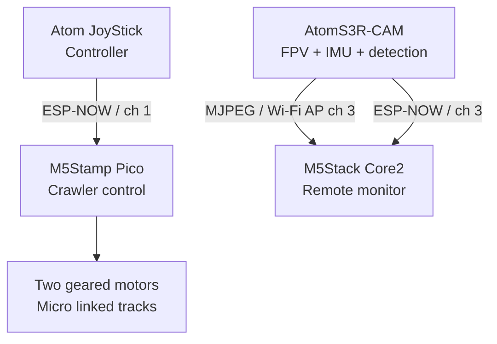

# MicroLink Crawler

English | [日本語](README_ja.md)

**[Grand Prize Winner — M5Stack Global Innovation Contest 2026](https://m5stack.com/global-innovation-contest-2026/results)**

[▶ Watch the demo video on YouTube](https://www.youtube.com/watch?v=ZiZfx9JVto8)

MicroLink Crawler is a pocket-sized FPV exploration rover centred on a **30 × 30 mm crawler drive module** and 7 mm-wide, 3D-printed linked tracks. A detachable AtomS3R-CAM provides FPV video, orientation data, and red-object detection; an M5Stack Core2 acts as the remote monitor and an Atom JoyStick as the wireless controller.

This repository is a project archive, not a complete reproduction manual. Mechanical fit, printing results, and electronic assembly can require adjustment for the parts and tools in use.

## Highlights

- 30 × 30 mm crawler drive module
- Functional 7 mm-wide 3D-printed linked tracks
- 6 mm-diameter planetary geared motors
- Detachable AtomS3R-CAM module
- Live MJPEG FPV video
- Real-time heading and tilt display on Core2
- Red-object detection with a bounding box and centre coordinates
- Wireless operation with Atom JoyStick
- The complete system fits in a book-sized carrying case

## Award

MicroLink Crawler received the Grand Prize in the [M5Stack Global Innovation Contest 2026 results](https://m5stack.com/global-innovation-contest-2026/results). The public result identifies the project as a 30 mm FPV crawler with 7 mm printed tracks, live video, orientation data, and red-object detection. No unreported judging rationale is inferred here.

- [M5Stack Global Innovation Contest 2026 Results](https://m5stack.com/global-innovation-contest-2026/results)
- [Hackster.io project page](https://www.hackster.io/user2729037/microlink-crawler-379ff1)

## System overview

The system separates two wireless functions: Atom JoyStick sends crawler-control packets to Stamp Pico over ESP-NOW on Wi-Fi channel 1, while AtomS3R-CAM provides the camera/Core2 function on channel 3. The camera serves MJPEG through its access point and sends IMU data to Core2 through ESP-NOW.

Read more: [system overview](docs/system-overview.md).

## Micro linked tracks

The 7 mm-wide linked tracks were developed by progressively reducing a larger prototype. They were made with a standard 0.4 mm-nozzle FDM printer. A centre guide groove and openings that engage the sprocket teeth help keep the track aligned, transfer torque, and reduce derailment or slip. The drive uses 6 mm-diameter planetary geared motors.

Read more: [micro linked tracks](docs/micro-linked-track.md).

## FPV, orientation, and red-object detection

The AtomS3R-CAM serves MJPEG video to Core2 through its Wi-Fi access point. Its IMU data is sent to Core2 over ESP-NOW, where heading and tilt are displayed. The camera firmware also detects red objects and sends the detection-box centre coordinates.

The Core2 monitor disables Wi-Fi power saving while streaming and favours the latest decoded frame when old frames must be dropped. On the camera side, a 350 ms TCP send timeout limits how long a slow client can hold up streaming work. These measures are intended to reduce prolonged video stalls.

Read more: [vision and telemetry](docs/vision-and-telemetry.md).

## Firmware

Each directory below is an independent PlatformIO project.

| Directory | Hardware | Role | Communication partner |
| --- | --- | --- | --- |
| `Firmware/MC_stamp_pico_crawler` | M5Stamp Pico | Controls the two motors and lights | Atom JoyStick |
| `Firmware/MC_AtomJoystick` | AtomS3 with Atom JoyStick Base | Remote control | M5Stamp Pico |
| `Firmware/MC_AtomS3R_CAM_GC0308_gylo` | AtomS3R-CAM with GC0308 | FPV, IMU, and red-object detection | Core2 |
| `Firmware/MC_Core2_cam_reciever_AP` | M5Stack Core2 | Video and orientation-information display | AtomS3R-CAM |

Read more: [firmware overview](docs/firmware-overview.md).

## 3D data

[`3D_Printer_Data/`](3D_Printer_Data/) contains STL files for printing and Fusion 360 F3D files for design inspection or editing. These are the design data used for the award project and are provided as structural reference data, not as a complete fabrication guide. Printer, material, and dimensional tolerances can require adjustment.

Read more: [3D data guide](3D_Printer_Data/README.md) and [development story](docs/development-story.md).

## Repository layout

| Path | Contents |
| --- | --- |
| `Firmware/` | Four independent PlatformIO firmware projects |
| `3D_Printer_Data/` | STL and Fusion 360 F3D mechanical design data |
| `docs/` | Project, track, vision, development, and firmware notes |

## Links and questions

- [M5Stack Global Innovation Contest 2026 Results](https://m5stack.com/global-innovation-contest-2026/results)
- [Hackster.io project page](https://www.hackster.io/user2729037/microlink-crawler-379ff1)
- [X: @GEH00073](https://x.com/GEH00073)
- [GitHub Issues](https://github.com/GEH00073/MicroLink_Crawler/issues/new)

Please use [GitHub Issues](https://github.com/GEH00073/MicroLink_Crawler/issues/new) first for technical questions so that answers can help other readers. Following or sending a direct message on X is optional.
