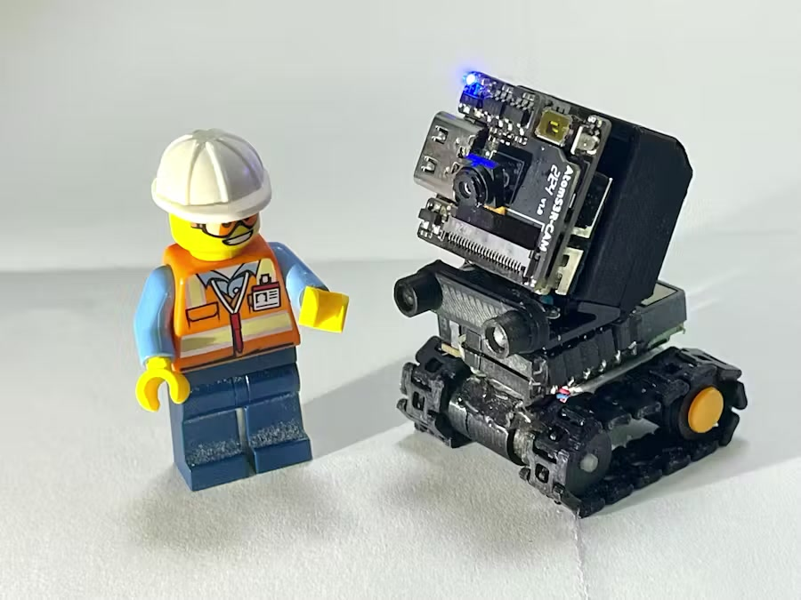
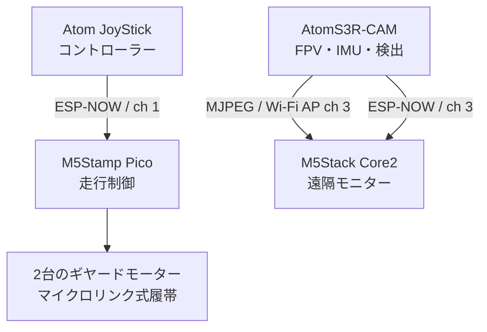

# MicroLink Crawler

[English](README.md) | 日本語

**[M5Stack Global Innovation Contest 2026 Grand Prize受賞](https://m5stack.com/global-innovation-contest-2026/results)**

[▶ YouTubeでデモ動画を見る](https://www.youtube.com/watch?v=ZiZfx9JVto8)

MicroLink Crawlerは、**30 × 30 mmのクローラー走行モジュール**と7 mm幅の3Dプリント製リンク式履帯を中心に構成した、ポケットサイズのFPV探査ローバーです。着脱可能なAtomS3R-CAMがFPV映像、姿勢情報、赤色物体検出を担当し、M5Stack Core2が遠隔モニター、Atom JoyStickが無線コントローラーとして機能します。

本リポジトリはプロジェクトアーカイブであり、同一品を完全に再現するための製作マニュアルではありません。機械的な組み合わせ、造形結果、電子部品の組み立ては、使用する部品や工具に応じて調整が必要になる場合があります。

## 特徴

- 30 × 30 mmのクローラー走行モジュール
- 機能する7 mm幅の3Dプリント製リンク式履帯
- 6 mm径の遊星ギヤードモーター
- 着脱可能なAtomS3R-CAMモジュール
- MJPEGによるライブFPV映像
- Core2へのリアルタイム方位・傾き表示
- 検出枠と中心座標を伴う赤色物体検出
- Atom JoyStickによる無線操縦
- システム全体をブックサイズの携帯ケースへ収納

## システム構成

本機は無線機能を2系統に分けています。Atom JoyStickからStamp Picoへの走行制御パケットはWi-Fiチャンネル1のESP-NOWを使用します。一方、AtomS3R-CAMとCore2の系統はチャンネル3で動作します。カメラはアクセスポイントからMJPEGを配信し、IMU情報をESP-NOWでCore2へ送信します。

詳細: [システム構成](docs/system-overview_ja.md)

## マイクロリンク式履帯

7 mm幅のリンク式履帯は、大型試作を段階的に縮小して開発され、一般的な0.4 mmノズルのFDMプリンターで造形されています。履帯中央のガイド溝とスプロケット歯に噛み合う開口部により、履帯の位置を保ち、トルクを伝達して外れや空転を抑えます。駆動には6 mm径の遊星ギヤードモーターを使用します。

詳細: [マイクロリンク式履帯](docs/micro-linked-track_ja.md)

## FPV・姿勢情報・赤色物体検出

AtomS3R-CAMはWi-Fiアクセスポイント経由でCore2へMJPEG映像を配信します。IMU情報はESP-NOWでCore2へ送られ、方位と傾きとして表示されます。カメラのファームウェアは赤色物体も検出し、検出枠の中心座標を送信します。

Core2モニターはストリーミング中にWi-Fi省電力を無効化し、古いフレームを捨てる必要がある場合は最新のデコード済みフレームを優先します。カメラ側では350 msのTCP送信タイムアウトにより、遅いクライアントがストリーミング処理を長時間止めることを抑えます。これらは長い映像停止を抑えるための処理です。

詳細: [FPV・姿勢情報・赤色物体検出](docs/vision-and-telemetry_ja.md)

## ファームウェア

以下の各ディレクトリは独立したPlatformIOプロジェクトです。

| ディレクトリ | ハードウェア | 役割 | 通信相手 |
| --- | --- | --- | --- |
| `Firmware/MC_stamp_pico_crawler` | M5Stamp Pico | 2台のモーターとライトの制御 | Atom JoyStick |
| `Firmware/MC_AtomJoystick` | AtomS3 + Atom JoyStick Base | 遠隔操縦 | M5Stamp Pico |
| `Firmware/MC_AtomS3R_CAM_GC0308_gylo` | AtomS3R-CAM + GC0308 | FPV、IMU、赤色物体検出 | Core2 |
| `Firmware/MC_Core2_cam_reciever_AP` | M5Stack Core2 | 映像・姿勢情報表示 | AtomS3R-CAM |

詳細: [ファームウェア構成](docs/firmware-overview_ja.md)

## 3Dデータ

[`3D_Printer_Data/`](3D_Printer_Data/)には、造形用のSTLと設計確認・編集用のFusion 360 F3Dファイルを収録しています。これらは受賞作品に使用した設計データで、構造を確認するための参考データとして公開しています。完全な製作手順ではなく、プリンター、材料、寸法公差に応じた調整が必要になる場合があります。

詳細: [3Dデータガイド](3D_Printer_Data/README_ja.md)／[開発の経緯](docs/development-story_ja.md)

## リポジトリ構成

| パス | 内容 |
| --- | --- |
| `Firmware/` | 4つの独立したPlatformIOファームウェアプロジェクト |
| `3D_Printer_Data/` | STLおよびFusion 360 F3Dの機械設計データ |
| `docs/` | 作品、履帯、映像、開発、ファームウェアの補足文書 |

## 関連リンクと問い合わせ

- [M5Stack Global Innovation Contest 2026 Results](https://m5stack.com/global-innovation-contest-2026/results)
- [Hackster.io作品ページ](https://www.hackster.io/user2729037/microlink-crawler-379ff1)
- [X: @GEH00073](https://x.com/GEH00073)
- [GitHub Issues](https://github.com/GEH00073/MicroLink_Crawler/issues/new)

技術的な質問は、ほかの閲覧者も回答を参照できるよう、まず[GitHub Issues](https://github.com/GEH00073/MicroLink_Crawler/issues/new)をご利用ください。XのフォローやDMは必須ではありません。
